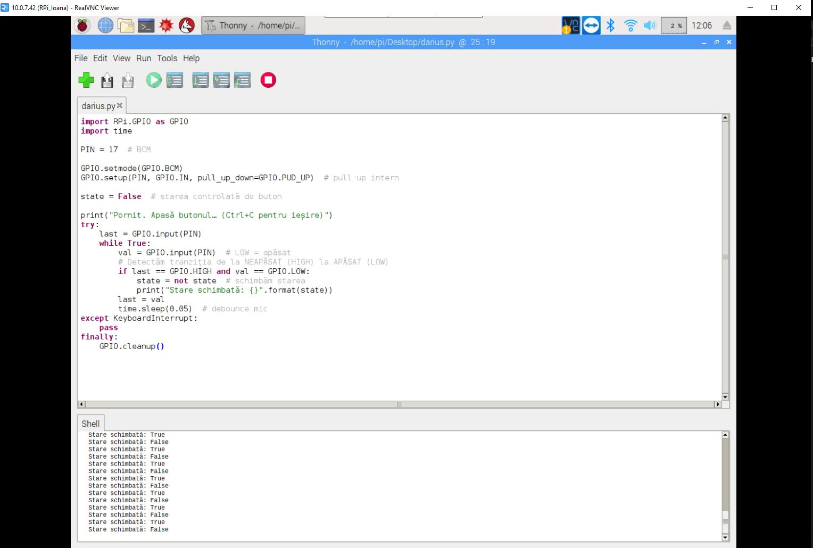
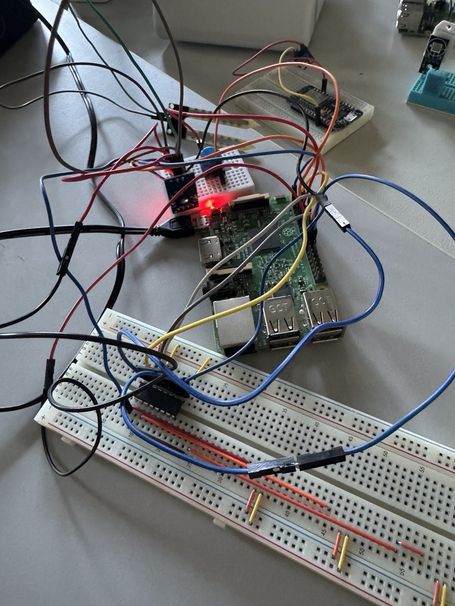
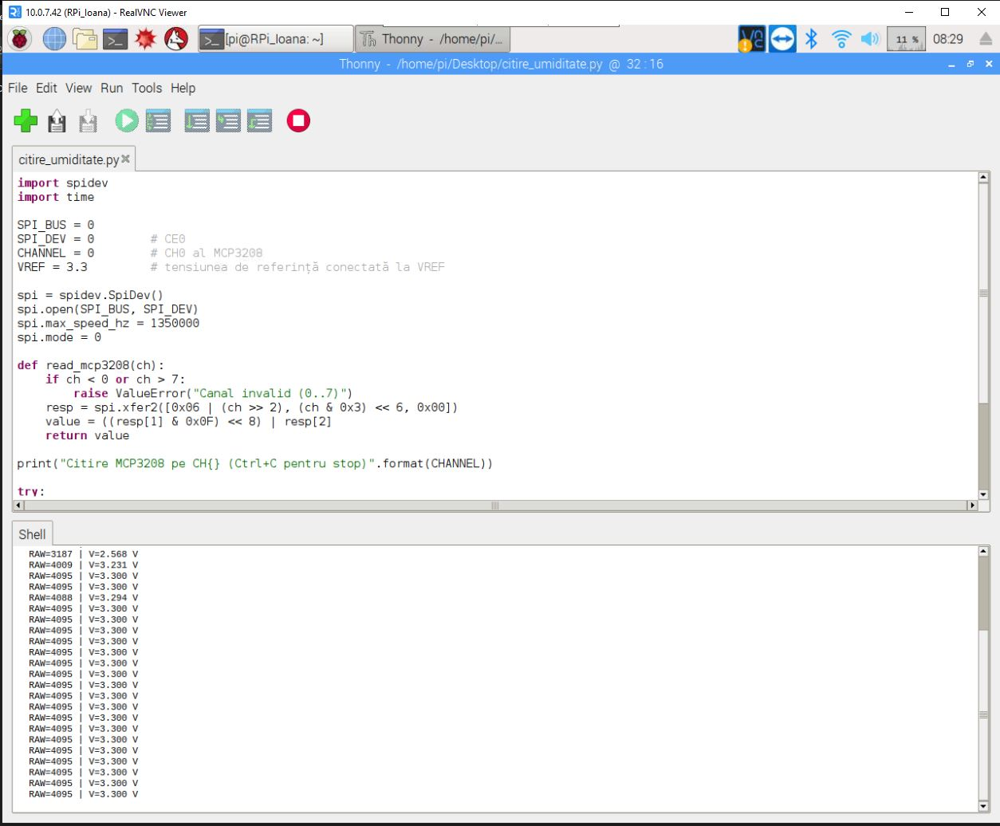
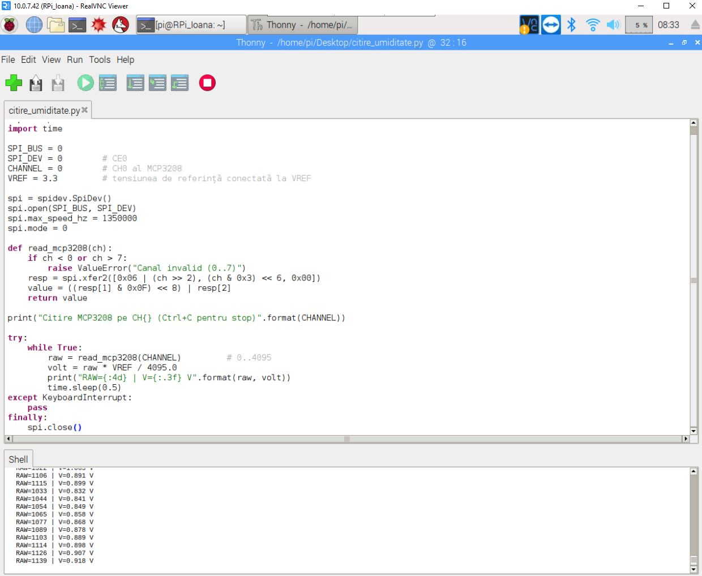
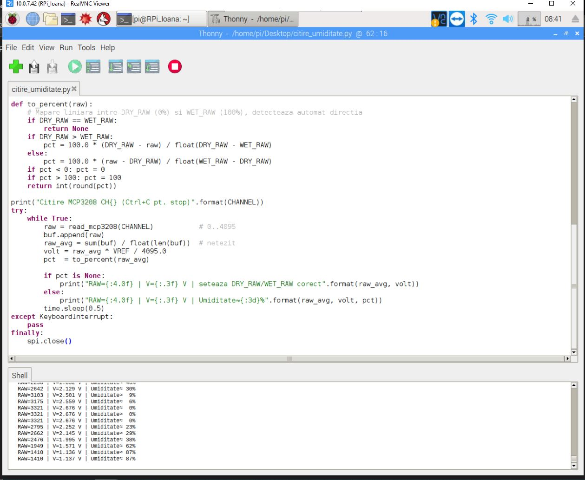
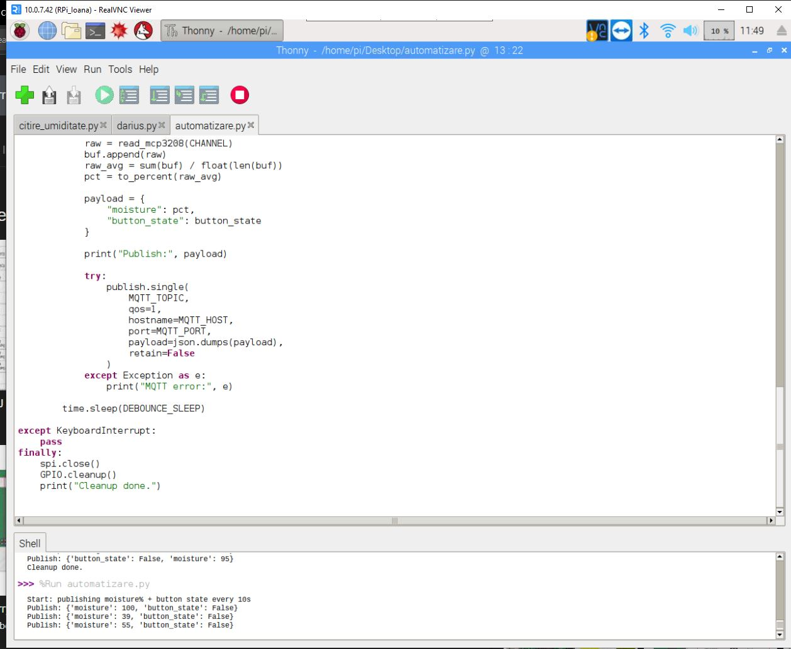
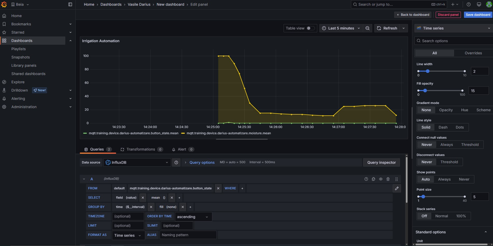
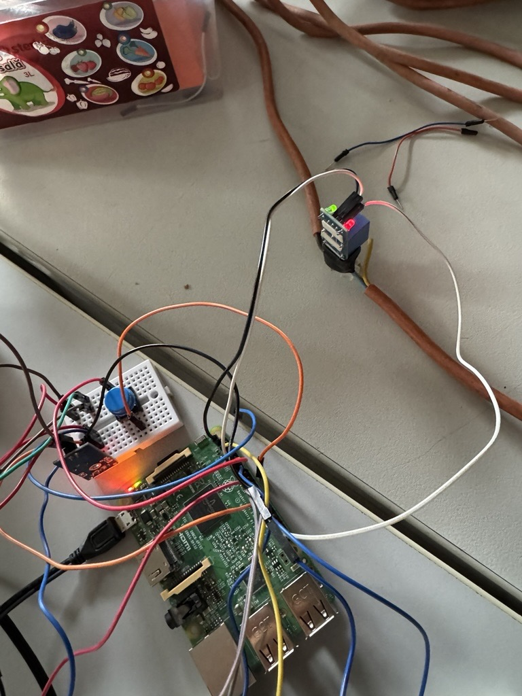
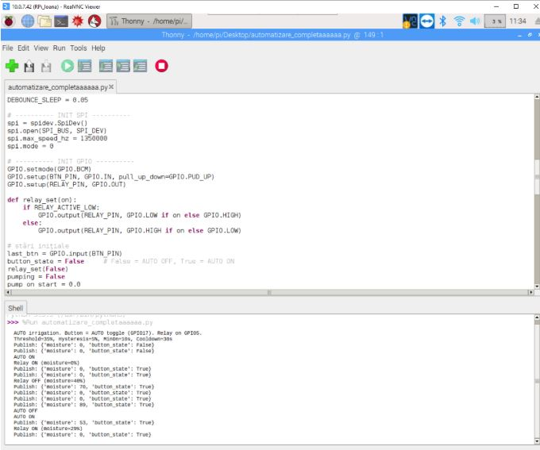

# Automation-Project-RaspberryPi
The purpose of this project is to design and implement an automatic irrigation system that is able to monitor soil moisture levels and water the plants whenever the soil becomes too dry. The system is intended to reduce manual work, optimize water consumption, and ensure that plants remain healthy. The main objective is to use a Raspberry Pi as the central controller, connected to a soil moisture sensor and a relay that switches the power supply of a Gardena irrigation system through a controlled outlet.

## Features
- Soil moisture acquisition via MCP3208 (12-bit) → percentage with dry/wet calibration
- Automatic irrigation: threshold + hysteresis + minimum ON time + cooldown
- Manual button (GPIO17) to toggle AUTO mode
- Relay control on GPIO5 (supports active-LOW modules)
- MQTT payload: `{ "moisture": <percent>, "button_state": true/false }`

## Hardware
- Raspberry Pi (any with 40-pin header)
- MCP3208 ADC
- Soil moisture sensor (analog output)
- Relay module (GPIO-driven, ideally opto-isolated)
- Gardena irrigation system powered through the relay-controlled outlet
- Breadboard & jumper wires

## Wiring (summary)
- MCP3208: VDD→3.3V, VREF→3.3V, AGND/DGND→GND, CLK→GPIO11, DOUT→GPIO9, DIN→GPIO10, CS→GPIO8
- Sensor AO→MCP3208 CH0, Sensor VCC→3.3V, Sensor GND→GND
- Button: one leg → GPIO17, opposite leg → GND (internal pull-up in code)
- Relay IN→GPIO5, VCC→(module spec: 3.3V or 5V), GND→GND (common with Pi)

## Implementation Progress
The implementation started with the configuration of the RaspberryPi. Installed the OS on the SSD, and then configured the device. Used RealVNC Viewer to control it remotely.
Then, began testing the connection, using a button connected to the Raspberry Pi in order to understand how to read digital inputs. This exercise provided a foundation for the logic later applied to the moisture sensor and the irrigation control.

  

The next step was to connect the soil moisture sensor. Since the sensor provides an analog signal, it was connected through the MCP3208 converter to the Raspberry Pi using the SPI interface. The wiring was completed by linking VDD and VREF of the MCP3208 to 3.3V, AGND and DGND to ground, CLK to GPIO11, DOUT to GPIO9, DIN to GPIO10, and CS to GPIO8. The analog output of the sensor was connected to channel 0 of the MCP3208.

  

Now, the data can be read with the Raspberry Pi.

  

These are the values received when the sensor is in the air. It displays the reference value (3.3V) when it is dry.

  

These are the values received when the sensor is in the water. The voltage drops to nearly 0.9V, which is the equivalent to 100% humidity.

  

Here, the humidity is also displayed in %.

Next up, created a payload with the state of the button and the soil humidity in %, sent it through MQTT and displayed it in dashboards in Grafana.

  

  

Then, connected the relay on the Raspberry Pi (3.3V, GND and GPIO5) and created a code that controls this relay with the button from earlier.

  

Now, when running the code, the Gardena Watering System starts when pressing the button. 
As a last addition to this project, generated a code that automatically turns the relay on, if the soil humidity percentage drops under 35%.

  

## Conclusion

This project successfully integrates a soil moisture sensor, an MCP3208 ADC, a Raspberry Pi, a button, and a relay into a functional automated irrigation system. The Raspberry Pi reads soil moisture levels in real time, sends data to an MQTT broker, visualizes it in Grafana, and automatically controls a relay connected to a water pump whenever the soil becomes too dry. A manual button also provides the ability to toggle automation mode, combining both automatic and manual control in a simple and reliable design.
The project is useful as a low-cost smart irrigation prototype, showing how IoT and automation can reduce water waste and ensure plants are watered only when necessary. By publishing data through MQTT, it can be easily integrated into larger IoT projects such as SIOTIN. In such contexts, this solution could scale from individual plant care to larger agricultural or greenhouse systems, helping to improve resource efficiency and sustainability.

